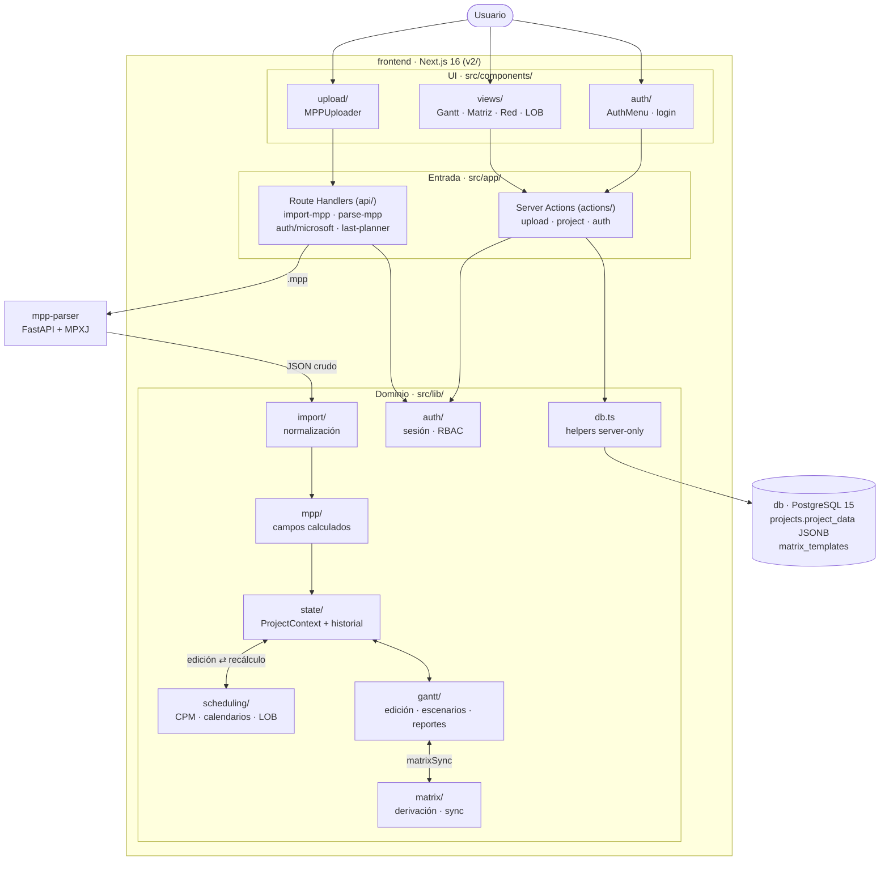

# Esquema de la aplicación

Visor Gantt es una app de planificación de obra: importa cronogramas de MS Project (`.mpp`/`.xml`),
los recalcula con un motor CPM propio, los presenta como Gantt/matriz/línea de balance y los
persiste completos en PostgreSQL.

## Diagrama

Cada flecha corresponde a un flujo documentado en `memoria/flujos/` (tabla más abajo).

## Servicios (Docker Compose)

| Servicio | Qué es | Página |
|---|---|---|
| `frontend` | Next.js 16 (App Router, React 19, TS estricto) en `v2/` — toda la app | [[arquitectura]] |
| `mpp-parser` | FastAPI + MPXJ (Java) — único que lee el binario `.mpp` | [[mpp-parser]] |
| `db` | PostgreSQL 15 — proyectos en `projects.project_data` (JSONB) | [[persistencia]] |
| `pgadmin` | Opcional, administración de la base | — |

`frontend` espera `depends_on: service_healthy` de `mpp-parser`; el schema se inicializa con
`v2/scripts/init-schema.sql` solo en volúmenes nuevos.

## Capas dentro de `v2/`

1. **Rutas y entrada** — `v2/src/app/`: páginas, Server Actions (`actions/`) y Route Handlers
   (`api/`). Los archivos grandes (multipart) entran por Route Handlers; las mutaciones acotadas,
   por Server Actions.
2. **Dominio** — `v2/src/lib/`: [[memoria/arquitectura/importacion-modulo|importacion]],
   [[mpp-calculo]], [[memoria/arquitectura/scheduling-modulo|scheduling]], [[matriz]], [[gantt]],
   [[reportes]], [[auth]], [[integraciones]], [[persistencia]]. Funciones puras y testeables; la
   UI orquesta, no duplica reglas.
3. **UI** — `v2/src/components/`: Server Components por defecto, `"use client"` solo donde hay
   estado/eventos. El estado editable vive en `v2/src/lib/state/ProjectContext.tsx` con historial.

## Flujos de trabajo

El detalle de cada flujo vive en `memoria/flujos/`, una página por flujo:

| Flujo | Recorre |
|---|---|
| [[importacion-mpp]] | Subida del `.mpp` → parser → normalización → cálculo → persistencia |
| [[autenticacion-y-sesion]] | Login (contraseña o Microsoft) → cookie de sesión → RBAC |
| [[edicion-y-recalculo]] | Edición en el Gantt → motor CPM → rollups y ruta crítica |
| [[sincronizacion-matriz-gantt]] | Simetría bidireccional Matriz ↔ Gantt |
| [[analisis-y-reportes]] | Asistente, escenarios what-if, dashboard ejecutivo, LOB y curva S |
| [[guardar-y-reabrir]] | Estado editable → JSONB → recargar → reabrir sin pérdida |
| [[integracion-last-planner]] | Plan del Gantt → preview Last Planner |

Los flujos de **proceso** (QA, despliegue) no son de la app: viven en
[[qa-y-entorno]] y en [[runbook-deploy-produccion-hetzner]].
