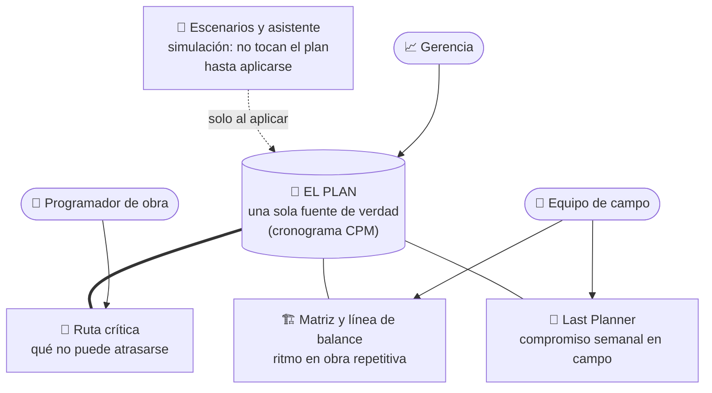
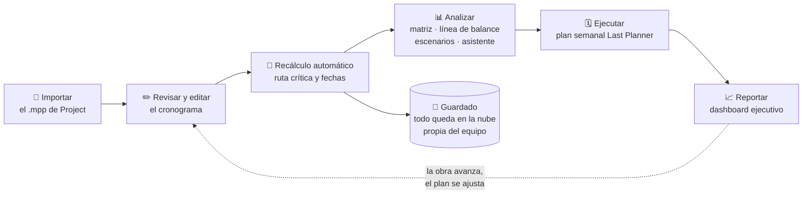

# Esquema estratégico y de metodología

Este es el esquema **para personas**, no para código: qué hace Visor Gantt, para quién y con qué
método. El plano técnico es [[esquema-app]].

## El problema que resuelve

Los cronogramas de obra se hacen en Microsoft Project, pero Project es caro, cerrado y difícil de
compartir con el equipo de campo. Visor Gantt toma ese mismo cronograma (`.mpp`) y lo convierte en
una herramienta viva en el navegador: se puede ver, editar, recalcular, analizar y compartir sin
licencias de Project — y sin perder fidelidad con el archivo original.

## Para quién

| Rol | Qué le da la app |
|---|---|
| **Programador de obra** | Importa el `.mpp`, edita tareas y dependencias, y el cronograma se recalcula solo (ruta crítica, holguras, calendarios con festivos). |
| **Residente / equipo de campo** | La programación matricial (unidad × actividad) y la vista Last Planner: qué se hace esta semana, en qué piso, en qué orden. |
| **Gerencia** | Dashboard ejecutivo: avance, presupuesto, hitos, curva S — y exportable a reporte. |

## La metodología que implementa

La app no inventa un método: combina tres prácticas estándar de planificación de obra y las
mantiene sincronizadas entre sí.

1. **Ruta crítica (CPM)** — el método clásico de Project: cada tarea tiene predecesoras, duración y
   calendario; el motor calcula qué tareas no pueden atrasarse sin atrasar la obra. Es la columna
   vertebral: todo lo demás se deriva de aquí.
2. **Programación rítmica (matriz y línea de balance)** — para obra repetitiva (torres, pisos,
   casas iguales): la matriz cruza unidades con actividades y la línea de balance muestra si las
   cuadrillas avanzan a ritmo parejo o van a chocar. La app la deriva automáticamente del
   cronograma; no hay que armarla dos veces.
3. **Last Planner** — la planificación semanal colaborativa con el equipo de campo: la app traduce
   el plan general a la vista semanal para comprometer trabajo real.

**Principio rector:** una sola fuente de verdad. El cronograma CPM manda; matriz, línea de balance,
reportes y Last Planner son vistas del mismo plan, siempre sincronizadas. Lo que se analiza (
escenarios "¿qué pasa si…?", recomendaciones del asistente) es simulación: **nada cambia el plan
hasta que el usuario lo aplica**.

## El recorrido del usuario

El ciclo se repite durante toda la obra: importar una vez, ajustar cada semana, reportar siempre
desde el mismo plan.

## Promesas al usuario (los "no negociables")

- **Fidelidad**: lo que dice el `.mpp` original se conserva; la app nunca sobrescribe en silencio
  los datos de Project.
- **Sin sorpresas**: si el archivo viene con errores (ciclos, referencias rotas), la app los
  muestra en claro y conserva el último cronograma válido en vez de romperse.
- **Nada se pierde**: todo cambio sobrevive guardar, recargar y reabrir el proyecto.
- **Análisis sin riesgo**: simular escenarios nunca toca el plan real.

Los flujos que sostienen cada promesa están en `memoria/flujos/` (ver [[esquema-app]]).
